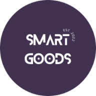

# Smart Goods

Clear and well-documented requirements are crucial for ensuring a structured and well-planned development process in software projects. The objective of this project is to develop a software that enables users to create and save project-specific requirements using [Chris Rupp's](https://www.sophist.de/fileadmin/user_upload/Bilder_zu_Seiten/Publikationen/RE6/Webinhalte_Buchteil_3/Requirements_Templates_-_The_Blue_Print_of_your_Requirements_Rupp.pdf) template. The system consists of a backend and a frontend, providing users with access to requirements through an iOS application or a web application.

Associated Github Repos:
* [Backend](https://github.com/marjanom/smartgoods_project)
* [iOS application](https://github.com/ebucelik/smartgoods)
* [Web application](https://github.com/lisamariepleyer/smartgoods-website) *(current repo)*

To run the web application in development mode, use

### `npm start`

or open [http://localhost:3000](http://localhost:3000) to view it in your browser.
